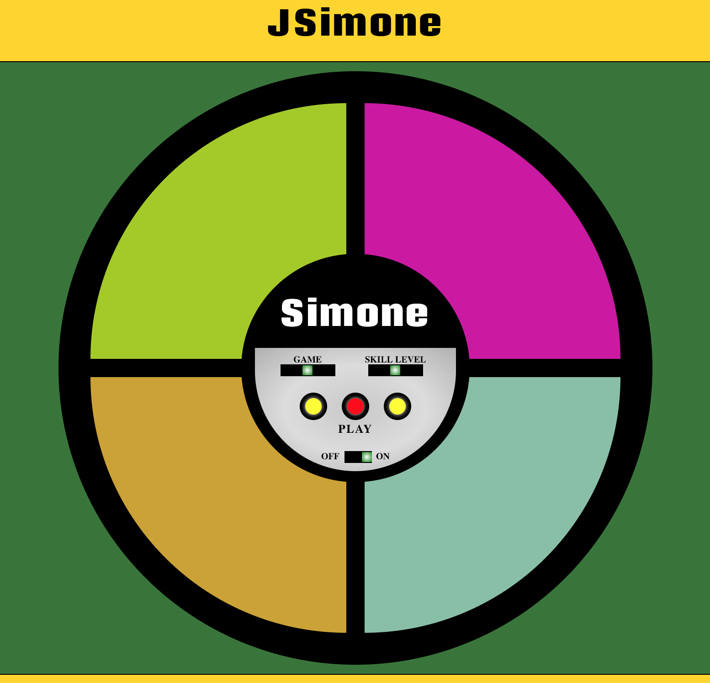

# Simone

#### Introduction

**Title**: Simone

**Status**: development

mock up by Steve Hanlon

*Simone* is based on the popular memory game from the 70s.  

Simone plays a sequence of colored squares (accompanied with tones) and the player must play back the same sequence.

[Sample at CodePen](https://codepen.io/SixStringsCoder/full/jdPGmx)

##### Start-up Server

To run the server, NPM or Yarn must be installed.

Open up the terminal and go to the project directory.  Inside of the project directory, run:

`npm install`

`npm start`

If you have Yarn installed run:

`yarn start`

This project was built using *Create React App*.  For complete technical details click [Create React App](./docs/README.md)

##### Technical Components
- CSS Flexbox.
- JavaScript (ECMASript 6)

##### Articles and Tutorials

#### Picture of Data and Components Breakdown

#### Pictures of Responsive Design
##### Phone

##### Tablet

##### Desktop

### Future Features
-
